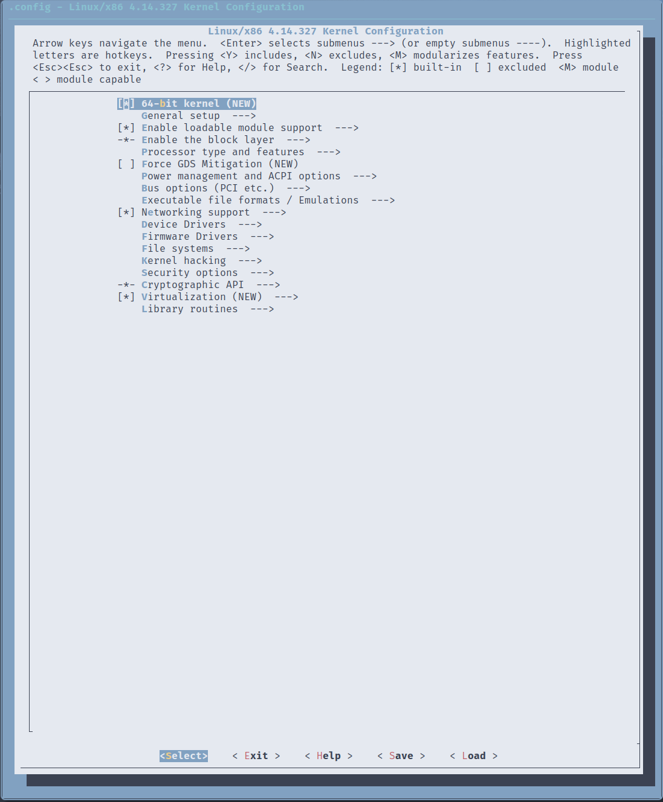

# 编译内核并添加系统调用

## 下载linux内核

- 下载**4.14.327**到本机

  [Linux内核下载地址](https://kernel.org/)

  ```shell
  ❯ ls
  linux-4.14.327.tar.xz
  ```

- 在当前目录解压

  ```shell
  ❯ tar -xvf linux-4.14.327.tar.xz
  linux-4.14.327/
  linux-4.14.327/.cocciconfig
  linux-4.14.327/.get_maintainer.ignore
  linux-4.14.327/.gitattributes
  linux-4.14.327/.gitignore
  linux-4.14.327/.mailmap
  linux-4.14.327/COPYING
  linux-4.14.327/CREDITS
  linux-4.14.327/Documentation/
  linux-4.14.327/Documentation/.gitignore
  ...
  ```
## 内核源码组织

```shell
❯ tree -L 1
.
├── arch	#平台相关的代码
├── block	#块设备相关的模块
├── certs
├── COPYING
├── CREDITS
├── crypto	#加密散列压缩校验相关的代码
├── Documentation
├── drivers	#设备驱动
├── firmware	#固件
├── fs	#文件系统
├── include	#头文件
├── init	#内核初始化
├── ipc	#进程间通信
├── Kbuil
├── Kconfig
├── kernel
├── lib	#常用数据结构和算法
├── MAINTAINERS
├── Makefile
├── mm	#地址空间
├── net	#网络栈 
├── README
├── samples
├── scripts
├── security
├── sound
├── tools
├── usr
└── virt
```

## **Linux系统调用**相关知识

- 系统调用表

  - 路径`arch/x86/entry/syscalls/syscall_64.tbl`

  - 文件结构`<number> <abi> <name> <entry-point>`

  - 例子

    ```
    #
    # 64-bit system call numbers and entry vectors
    #
    # The format is:
    # <number> <abi> <name> <entry point>
    #
    # The abi is "common", "64" or "x32" for this file.
    #
    0       common  read                    sys_read
    1       common  write                   sys_write
    2       common  open                    sys_open
    3       common  close                   sys_close
    4       common  stat                    sys_newstat
    5       common  fstat                   sys_newfstat
    6       common  lstat                   sys_newlstat
    7       common  poll                    sys_poll
    8       common  lseek                   sys_lseek
    9       common  mmap                    sys_mmap
    10      common  mprotect                sys_mprotect
    11      common  munmap                  sys_munmap
    ...
    ```

- 系统调用服务例程

  - 头文件路径`include/linux/syscalls.h`

  - 服务例程声明格式

    `asmlinkage long sys_statx(int dfd, const char __user *path, unsigned flags,
    			  unsigned mask, struct statx __user *buffer);`

    `asmlinkage`显式地告诉编译器调用参数通过堆栈传递

  - 实现代码路径`kernel/sys.c`

  - 服务例程声明格式

    ```c
    SYSCALL_DEFINE3(setpriority, int, which, int, who, int, niceval) {
        //函数体
    }
    ```

## 编程实现

### 更改系统调用表

```
❯ diff syscall_64.tbl ../linux-4.14.327/arch/x86/entry/syscalls/syscall_64.tbl
342d341
< 333 common  my_set_nice sys_my_set_nice
```

### 编写服务例程

```c
// @params pid 要修改或读取的进程pid
// @params flag 为0读取, 为1时修改
// @params new_nice flag为1时有效, 修改nice值
// @params prio 把旧值写入prio的用户态地址
// @params nice 把旧值写入nice的用户态地址
// @return 0表示成功, -1表示失败
SYSCALL_DEFINE5(sys_my_set_nice, pid_t, pid, int, flag, int, new_nice,
                void __user *, prio, void __user *, nice) {
  if (flag != 0 && flag != 1) {
    return -1;
  }
  if (new_nice > 19 || new_nice < -20) {
    return -1;
  }
  struct task_struct *task;
  struct pid *pid_struct;
  int old_nice;
  int old_prio;
  pid_struct = find_get_pid(pid);
  if (pid_struct == NULL) {
    return -1;
  }
  task = pid_task(pid_struct, PIDTYPE_PID);
  if (task == NULL) {
    return -1;
  }
  old_nice = task_nice(task);
  old_prio = task_prio(task);
  if (flag == 1) {
    set_user_nice(task, new_nice);
  }
  copy_to_user(prio, &old_prio, sizeof(int));
  copy_to_user(nice, &old_nice, sizeof(int));
  return 0;
}
```

### 修改头文件

```
asmlinkage long sys_my_set_nice(pid_t pid, int flag, int new_nice,
                                void __user *prio, void __user *nice);
```

### 把修改后的代码整合进源代码中

```shell
❯ make
cp sys.c ../linux-4.14.327/kernel/sys.c
cp syscall_64.tbl ../linux-4.14.327/arch/x86/entry/syscalls/syscall_64.tbl
cp syscalls.h ../linux-4.14.327/include/linux/syscalls.h
```

## 编译内核

- 使用`make menuconfig`文本界面来设置编译选项裁剪内核

  

​	最大可能地裁剪内核缩短编译时间

```shell
❯ make -j12
  HOSTCC  scripts/kconfig/conf.o
  HOSTLD  scripts/kconfig/conf
scripts/kconfig/conf  --silentoldconfig Kconfig
#
# configuration written to .config
#
  SYSTBL  arch/x86/include/generated/asm/syscalls_32.h
  SYSHDR  arch/x86/include/generated/asm/unistd_32_ia32.h
  SYSHDR  arch/x86/include/generated/asm/unistd_64_x32.h
  SYSTBL  arch/x86/include/generated/asm/syscalls_64.h
  ...
```


## 编译安装busybox

- `busybox`是linux环境下的精简工具集和linux内核一起构成一个最小的执行环境

- 使用`make menuconfig`进行tui界面的编译选项配置

- 使用`make`和`make install`这对命令进行编译

- 编译产物会生成在源码的`_install`目录下

  ```
  ❯ ls
  bin  linuxrc  sbin  usr
  ```

## 制作内核镜像

### 前置知识

- linux启动流程

  ```mermaid
  flowchart TD;
  subgraph bios
  加电自检 --> 初始化硬件 --> 查找启动介质
  end
  bios --> mbr --> bootloader -->  initramfs,kernel --> 挂载rootfs --> init
  ```

  其中bootloader和之前的部分qemu已经帮我们完成了， 所以我们主要完成后面的部分

### 安装内核模块拷贝内核镜像拷贝busybox

```shell
❯ make modules_install INSTALL_MOD_PATH=../../myos
❯ j my__2__/home/ashenye/repo/2023-os-lab/02-add-syscall-and-compile-kernel/myos
❯ ls
lib
❯ cp ../src/linux-4.14.327/arch/x86/boot/bzImage .
❯ cp -r ../src/busybox-1.31.0/_install ./busybox
❯ ls
busybox  bzImage  lib
```

### 制作虚拟rootfs镜像


## 出现的问题

### 找不到符号`sys_my_set_nice`

```
ld: arch/x86/entry/syscall_64.o:(.rodata+0xa68): undefined reference to `sys_my_set_nice`
make: *** [Makefile:1049: vmlinux] Error 1
```

系统调用命名不规范

### 编译busybox时`/usr/bin/ld: cannot find -lcrypt: No such file or directory`

我用的linux发行版为了裁剪体积或者强制动态链接的未来证明安全性把libcrypt.a移除掉了用其他发行版的软件仓库的libcrypt.a就行了

```shell
wget 'http://ftp.cz.debian.org/debian/pool/main/libx/libxcrypt/libcrypt-dev_4.4.27-1.1_amd64.deb'
# verify deb package signature or download from multiple sources and use diff
ar x libcrypt-dev_4.4.27-1.1_
    Index
    » Programming & Scripting
    » [SOLVED] Static building of busybox fails, after update gcc/glibc?

amd64.deb
tar xf data.tar.xz
sudo cp usr/lib/x86_64-linux-gnu/libcrypt.a /lib/
sudo chmod o+r /lib/libcrypt.a
```

### 静态编译busybox失败

```
Static linking against glibc, can't use --gc-sections
Trying libraries: crypt m
Failed: -Wl,--start-group  -lcrypt -lm  -Wl,--end-group
Output of:
gcc -Wall -Wshadow -Wwrite-strings -Wundef -Wstrict-prototypes -Wunused -Wunused-parameter -Wunused-function -Wunused-value -Wmissing-prototypes -Wmissing-declarations -Wno-format-security -Wdeclaration-after-statement -Wold-style-definition -fno-builtin-strlen -finline-limit=0 -fomit-frame-pointer -ffunction-sections -fdata-sections -fno-guess-branch-probability -funsigned-char -static-libgcc -falign-functions=1 -falign-jumps=1 -falign-labels=1 -falign-loops=1 -fno-unwind-tables -fno-asynchronous-unwind-tables -fno-builtin-printf -Os -static -o busybox_unstripped -Wl,--sort-common -Wl,--sort-section,alignment -Wl,--start-group applets/built-in.o archival/lib.a archival/libarchive/lib.a console-tools/lib.a coreutils/lib.a coreutils/libcoreutils/lib.a debianutils/lib.a klibc-utils/lib.a e2fsprogs/lib.a editors/lib.a findutils/lib.a init/lib.a libbb/lib.a libpwdgrp/lib.a loginutils/lib.a mailutils/lib.a miscutils/lib.a modutils/lib.a networking/lib.a networking/libiproute/lib.a networking/udhcp/lib.a printutils/lib.a procps/lib.a runit/lib.a selinux/lib.a shell/lib.a sysklogd/lib.a util-linux/lib.a util-linux/volume_id/lib.a archival/built-in.o archival/libarchive/built-in.o console-tools/built-in.o coreutils/built-in.o coreutils/libcoreutils/built-in.o debianutils/built-in.o klibc-utils/built-in.o e2fsprogs/built-in.o editors/built-in.o findutils/built-in.o init/built-in.o libbb/built-in.o libpwdgrp/built-in.o loginutils/built-in.o mailutils/built-in.o miscutils/built-in.o modutils/built-in.o networking/built-in.o networking/libiproute/built-in.o networking/udhcp/built-in.o printutils/built-in.o procps/built-in.o runit/built-in.o selinux/built-in.o shell/built-in.o sysklogd/built-in.o util-linux/built-in.o util-linux/volume_id/built-in.o -Wl,--end-group -Wl,--start-group -lcrypt -lm -Wl,--end-group
==========
/usr/bin/ld: libbb/lib.a(xconnect.o): in function `str2sockaddr':
xconnect.c:(.text.str2sockaddr+0x11d): warning: Using 'getaddrinfo' in statically linked applications requires at runtime the shared libraries from the glibc version used for linking
/usr/bin/ld: coreutils/lib.a(mktemp.o): in function `mktemp_main':
mktemp.c:(.text.mktemp_main+0x99): warning: the use of `mktemp' is dangerous, better use `mkstemp' or `mkdtemp'
/usr/bin/ld: libbb/lib.a(xgethostbyname.o): in function `xgethostbyname':
xgethostbyname.c:(.text.xgethostbyname+0x5): warning: Using 'gethostbyname' in statically linked applications requires at runtime the shared libraries from the glibc version used for linking
/usr/bin/ld: libbb/lib.a(xconnect.o): in function `bb_lookup_port':
xconnect.c:(.text.bb_lookup_port+0x46): warning: Using 'getservbyname' in statically linked applications requires at runtime the shared libraries from the glibc version used for linking
/usr/bin/ld: util-linux/lib.a(rdate.o): in function `rdate_main':
rdate.c:(.text.rdate_main+0xf6): undefined reference to `stime'
/usr/bin/ld: coreutils/lib.a(date.o): in function `date_main':
date.c:(.text.date_main+0x23e): undefined reference to `stime'
collect2: error: ld returned 1 exit status
Note: if build needs additional libraries, put them in CONFIG_EXTRA_LDLIBS.
Example: CONFIG_EXTRA_LDLIBS="pthread dl tirpc audit pam"
make: *** [Makefile:718: busybox_unstripped] Error 1
```

glibc静态编译似乎不是很对付, 换用musl作为标准库

```shell
sudo pacman -S kernel-headers-musl musl #安装musl相关依赖
```

```shell
make -j8 CC=musl-gcc #重新编译, musl-gcc也是gcc不过gcc默认链接到glibc而musl-gcc链接到musl
```


https://zhuanlan.zhihu.com/p/469972204

https://zhuanlan.zhihu.com/p/424240082